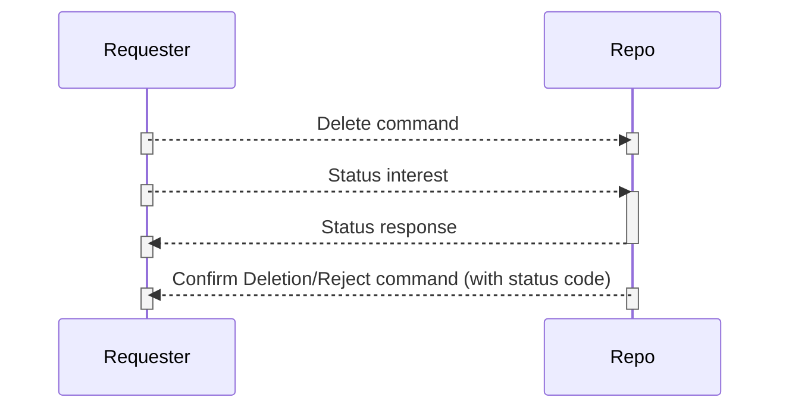

# Repo Deletion Protocol

Repo deletion protocol 은 [Repo Command]() 를 사용합니다.
특정 prefix 내의 단일 콘텐츠 객체 또는 콘텐츠 객체 삭제는 모두 repo 사양 (specification) 에서 지원됩니다. Selector 는 여러 콘텐츠 객체를 선택하는데 사용됩니다. 이러한 _selector_ 는 기존의 _interest_ 패킷 [selectors](http://named-data.net/doc/ndn-tlv/interest.html#selectors) 와 다릅니다. 기존 _interest selector_ 는 하나의 repo 데이터 패킷을 선택합니다. _delete command Selectors_ 는 이 _selector_ 에 적용되는 모든 데이터 패킷을 반환합니다. 세그먼트 데이터의 삭제도 지원됩니다.

## Basic operations

### Deletion command interest semantics

Command verb:  **delete**

_Deletion command interest_ 는 repo command 포멧을 따릅니다. 예:

```
/ucla/cs/repo/delete/<RepoCommandParameter>/<timestamp>/<random-value>/<SignatureInfo>/<SignatureValue>
```

## Formats

### Deletion Command RepoCommandParameter

_deletion command_ 의 포멧 RepoCommandParameter 는 Repo Command 를 따릅니다. Name, Selector, StartBlockId, EndBlockId, ProcessId 는 RepoCommandParameter 를 생성하는 데 사용됩니다.

Name 은 repo가 삭제할 데이터의 name 또는 prefix 입니다.

Selector 는 데이터를 선택하는데 사용됩니다. ChildSelector 는 삭제 명령에서 지원되지 않습니다.

StartBlockId 및 EndBlockId 는 세그먼트 데이터를 삭제하는데 사용됩니다. StartBlockId 와 EndBlockId 사이의 세그먼트 ID 데이터는 repo 에 의해 삭제됩니다.

ProcessId 는 클라이언트가 삭제 프로세스를 나타내기 위해 생성한 난수입니다. Repo 는 ProcessId 를 삭제 프로세스와 일치시킵니다.

### Deletion Command Selectors

_Deletion command selector_ 는 [repo command selectors](http://redmine.named-data.net/projects/repo-ng/wiki/Repo_Protocol_Specification#Repo-Command-Selectors) 다음에 옵니다.

### Deletion status check

deletion progress 동안 requester 는 _deletion status check command_ 를 전송하여 deletion progress 상태를 확인할 수 있습니다. _status check command_ 는 _signed interest_ 입니다. _deletion status check command_ 는 repo command 형식을 따릅니다. `<command verb>` 는 check 를 삭제하는 것과 같습니다. 예:

```
/ucla/cs/repo/delete/<RepoCommandParameter>/<timestamp>/<random-value>/<SignatureInfo>/<SignatureValue>
```

### Deletion status check RepoCommandParameter

Name 및 ProcessId 는 특정 삭제 프로세스를 나타내는데 사용됩니다. Repo 는 Name 과 ProcessId 를 사용하여 특정 삭제 프로세스를 일치시킵니다. 일치하면 repo 가 삭제 진행 상황에 응답합니다. Name 또는 ProcessId 중 하나만 일치하면 실패합니다.

### Deletion Check Command Selectors

Selectors 는 지원되지 않습니다. Repo 는 deletion status check command 를 처리 할 때 selectors 를 무시합니다.

### Deletion status response

_Deletion status_ 응답은 _repo deletion command_ 및 _repo deletion check command_ 의 응답으로 사용됩니다.

Name, StatusCode, Selector, StartBlockId, EndBlockId, ProcessId, DeleteNum 은 삭제 상태 응답에 사용됩니다. Name, ProcessId, Selector 는 delete 명령과 동일합니다. StatusCode 는 삭제 상태를 나타냅니다. DeleteNum 은 삭제 된 데이터 패킷 수를 나타냅니다.

_Repo Deletion Command_ 에서 StartBlockId 가 나타나면 EndBlockId 가 Repo 가 보유한 가장 큰 세그먼트 ID 일 수 있습니다. EndBlockId 가 나타나면 StartBlockId 가 0 으로 설정됩니다.

StatusCode Definition:

|StatusCode|Description|
|---|---|
|200|모든 데이터 삭제|
|300|삭제가 진행 중|
|401|삭제 또는 삭제 검사 무효화|
|402|Selectors 또는 BlockId 없음|
|403|Malformed Command|
|404|삭제 작업 이상|

## Protocol process

1. command authorize 시작; 승인이 실패하지 않으면 3 단계로 이동
2. authorization failure 응답을 보내고 단계를 중단하고 삭제 프로세스 종료 (StatusCode : 401) 
3. 동일한 RepoCommandParameter 의 삭제 프로세스가 삭제 프로세스를 기다리는지 여부 확인
4. Selector 와 StartBlockId 및 EndBlockId 중 하나가 표시되면 응답을 보내고 단계를 중단하고 삭제 프로세스 종료 (StatusCode: 402)
5. Selector 가 있는 경우; 8 단계로 이동
6. StartBlockId 또는 EndBlockId 가 나타나는지 확인; StartBlockId 가 EndBlockId 보다 크면 부정적 응답을 반환하고 삭제 프로세스를 종료; (StatusCode : 403) 또는 9 단계 이동
7. StartBlockId, EndBlockId 및 Selector 가 모두 누락 된 경우 10 단계로 이동
8. name 과 selector 를 준수하는 모든 데이터를 삭제하고 11 단계로 이동
9. StartBlockId 와 EndBlockId 사이의 세그먼트 ID의 모든 데이터 패킷을 삭제; StartBlockId 가 없으면 StartBlockId 는 0 으로 설정; EndBlockId 가 누락 된 경우 EndBlockId 는 repo 가 보유하는 가장 큰 세그먼트 ID 로 설정; 11 단계로 이동
10. name 과 같은 prefix 가 있는 모든 데이터를 삭제; 11 단계로 이동
11. interest 가 만료되지 않으면 긍정적인 상태 코드의 상태 응답 반환; interest 기간이 만료된 경우 동일한 RepoCommandParameter 에 대한 interest 를 기다리고 상태 응답을 반환; 삭제 프로세스 종료 (StatusCode : 200) 

클라이언트는 deletion command 를 설정합니다. lifetime 이 만료되면 클라이언트는 명령을 다시 표현합니다. (re-express)

구현은 삭제 진행에 대한 상태 통지를 발표 할 수 있습니다. 상태 확인 프로세스는 다음과 같습니다.

1. delete status command authorize 시작
2. authorization failure 응답을 보내고 단계를 중단 (StatusCode: 401)
3. command 에 데이터 이름을 사용하여 삭제 진행 상황을 점검하기 시작; progress 상황이 발견되지 않으면 4 단계로 이동하거나 5 단계로 이동
4. 응답 코드 404 (상태 코드: 404)
5. 삭제 상태 확인 (상태 코드 : 300)

### Protocol diagram:


